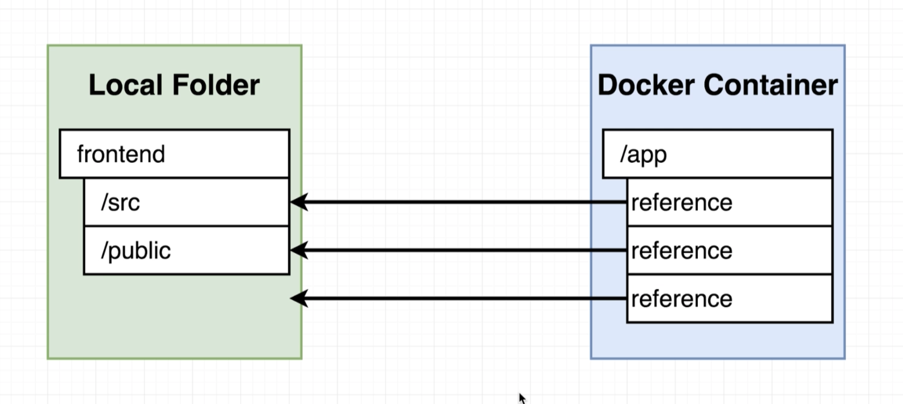
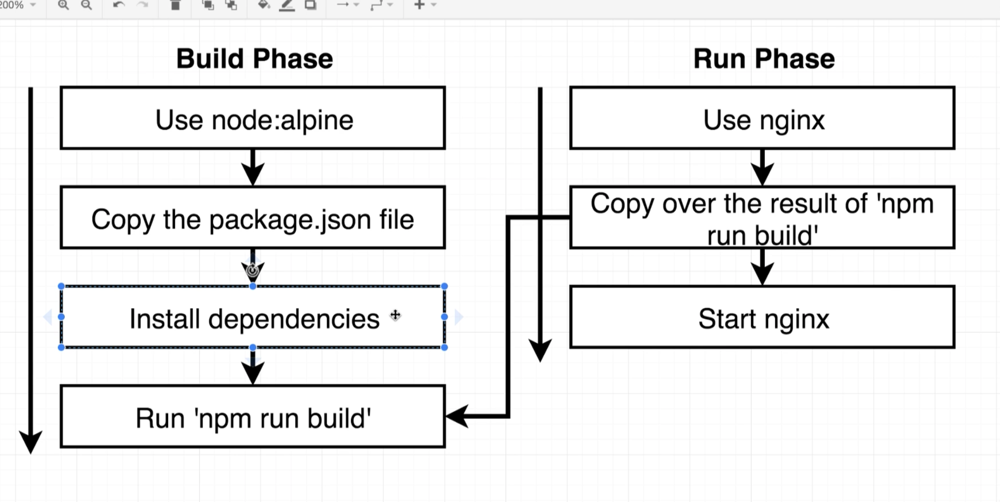

The `Dockerfile.dev` will be the docker container that will be run when we run our application in development mode.

# Volumes

Volumes are used to propagate a running docker container with any changes made locally, so a developer can continuously develop without having to rebuild a docker image and start up a new docker container.

Important commands
```bash
# This command creates a mapping between files in our current local directory to within the docker container
docker run -p 3000:3000 -v /app/node_modules -v $(pwd):/app <image_id>
```
- `-v $(pwd):/app` - Take everything in the current working directory and map it all to the `app` folder in the docker container.
- `-v /app/node_modules` - When this command is ommitted, we get a very interesting error:

```bash
Dylans-MBP:frontend dylanmorison$ docker run -p 3000:3000 -v $(pwd):/app 4a6b2c3a5266468211e9fa4e8e4a99985dc16eb1be45f75d818a6db8c9288fd5

> frontend@0.1.0 start
> react-scripts start

sh: react-scripts: not found
npm notice 
npm notice New minor version of npm available! 7.15.1 -> 7.19.0
npm notice Changelog: <https://github.com/npm/cli/releases/tag/v7.19.0>
npm notice Run `npm install -g npm@7.19.0` to update!
npm notice 
```
This error is caused because we are telling docker to create a mapping between files in our current local working directory, to within the `/app` folder within our docker container. However, since we removed our `node_modules` directory locally the docker container is referencing nothing, as the following diagram shows:



To fix this we of course run `-v /app/node_modules`. Notice how there is no colon, this is us telling docker to *not* map `node_modules` to anything from within the docker container.  In the other command, `-v $(pwd):/app`, we have a colon to convey that we want to map *everything* between our local directory and `/app`, so that any change we make is reflected within the docker container.

# Docker Compose
The whole purpose of docker compose is to make running a docker container easier. We can create a Docker compose file to make this particular command easier to use/write:
```bash
docker run -p 3000:3000 -v /app/node_modules -v $(pwd):/app <image_id>
```

Instead, we can create a `docker-compose.yml` file and add the following code to it
```Dockerfile
#6-73 docker-compose to automate lengthy docker run command using volumes inter alia
version: '3'
services:
  web:
    build:
      context: .
      dockerfile: Dockerfile.dev
    # web as server/container name - build context (. - could be path) pwd with custom Dockerfile name
    ports:
      - "3000:3000"
    volumes:
      # (1) do *not* try to map a folder against /app/node_modules in the container;
      - /app/node_modules
      # (2) map current working directory (outside container):/app folder in container
      - .:/app
```
And now, instead of running the really long command, we can simply run `docker-compose up`.

# `npm run test` our React App within our docker container.

Now say we want to run `npm run test` after we have started up our react app. To do this, we simply need to run
```bash
docker run <Image_ID> npm run test
```
However notice we left something off! Without the `-it` command we do not get a stable connection to standard input, we are only getting standard output of the docker container. As such, we can't actually press `enter` or `q` or any other commmand.  To fix this, run 
```bash
docker run -it <Image_ID> npm run test
```

Now, try editing something in `app.test.js`, notice that the running docker container is not aware of these updates??? We haven't set up docker volumes or live mappings to deal with this!

One of the easiest/quickest ways to solve this problem is to run
```
docker ps
```
get the id of our running container that already has volumes set up, and run 
```
docker exec -it c28b1e985ed3 npm run test
```
Now you should be able to run tests when they change! However this is more of a quick fix. Lets explore some other options.

A "better" option would be to set up volumes for the test suites. As such:

```dockerfile
#6-73 docker-compose to automate lengthy docker run command using volumes inter alia
version: '3'
services:
  web:
    build:
      context: .
      dockerfile: Dockerfile.dev
    # web as server/container name - build context (. - could be path) pwd with custom Dockerfile name
    ports:
      - "3000:3000"
    volumes:
      # (1) do *not* try to map a folder against /app/node_modules in the container;
      - /app/node_modules
      # (2) map current working directory (outside container):/app folder in container
      - .:/app
  tests: 
    build: 
      context: .
      dockerfile: Dockerfile.dev
    volumes: 
      - /app/node_modules
      - .:/app
    command: ["npm", "run", "test"]
```

However, we are left with the same problem of not attaching to `stdin`, so we cannot rerun tests, or enter any commands to the test suites.  We can run
```bash
docker attach <CONTAINER_ID>
```
to attach to the primary process inside a container. Unfortunetly, this will not work with docker compose.

```Dockerfile
# Open sh shell inz
docker exec -it <Docker Image> sh
```

# Production

We will use nginx and Docker for production. There will be two phases, a build phase and a run phase.


# Travis CI
The purpose of Travis CI is to run our test suite 
Here is what we need to tell Travis in our development workflow:
- Tell Travis we need a copy of docker running
- Build our image using Dockerfile.dev
- Tell Travis how to run our test suite
- Tell Travis how to deploy our code to AWS